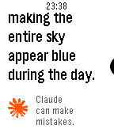
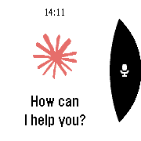
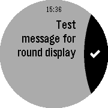
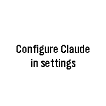
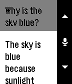
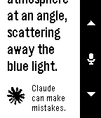
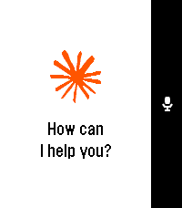
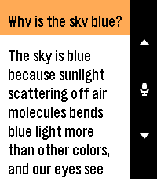
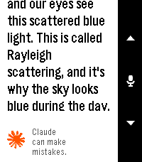

# Claude for Pebble

Chat with Claude AI directly from your Pebble smartwatch. This app is unaffiliated with Anthropic and was made by independent developers as an open-source initiative.

## Supported Platforms

This app supports the following Pebble smartwatch models:
- **Pebble Time** (basalt) - Color rectangular display
- **Pebble Time Round** (chalk) - Color round display
- **Pebble 2** (diorite) - Black & white rectangular display
- **Pebble Time 2** (emery) - Color rectangular display

## Features

- **Voice Input.** Use Pebble's built-in voice dictation to send messages to Claude
- **Real-time Streaming.** Receive responses from Claude as they're generated, streamed in real-time to your watch
- **Conversation History.** Maintains context throughout your conversation with scrollable message history
- **Animated Claude Spark.** Features the iconic Claude spark animation while waiting for responses
- **Configurable.** Customize API endpoint, model selection, and system prompts

## Screenshots

### Basalt

### Chalk (Round Display)

### Diorite

### Emery

